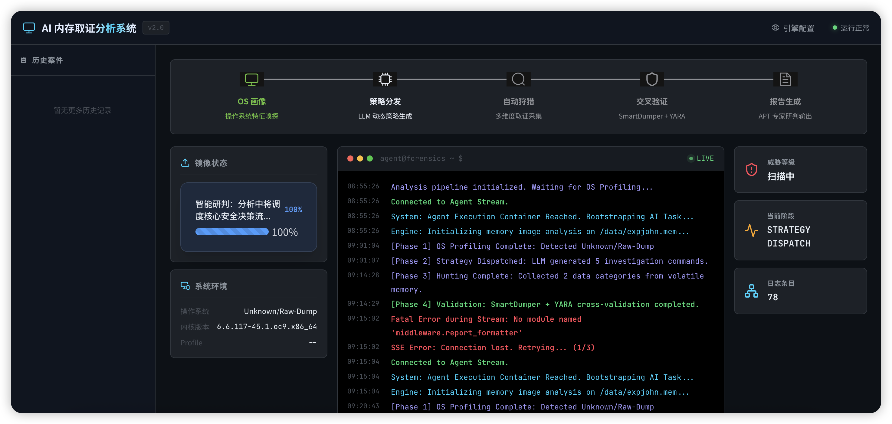

# 🧠 AI 驱动的内存取证智能体系统

> **毕业设计项目** — 基于 LangGraph 状态图工作流的智能化数字取证平台

[](https://www.python.org/)
[](https://vuejs.org/)
[](https://docs.docker.com/compose/)
[](#)

---

## 📖 项目简介

> **👉 终端演示 (Terminal Demo)**: 
> 
> 

> ⚠️ **声明**: 该项目持续维护中，部分高级特性（如针对特定 EDR 绕过的自动化研究）暂不开源，欢迎私下交流。

本系统是一个基于大语言模型（LLM）与 Volatility 内存取证框架的全自动化数字取证分析平台。用户仅需上传目标终端的内存转储文件（`.mem` / `.raw`），系统即可自动完成操作系统识别、多维度安全狩猎、高级逃逸检测与全文研判报告生成，全程无需人工介入。

### 核心特点

- 🤖 **五阶段 AI 驱动工作流**：基于 LangGraph StateGraph 构建完整的取证分析链路
- 🔬 **双引擎兼容**：同时支持 Volatility 3（ISF 符号表）和 Volatility 2（Profile）
- 🛡️ **高级逃逸检测**：内置 DKOM 隐藏进程检测、孤儿进程溯源、父子关系异常检测
- 📊 **可视化仪表盘**：Vue3 实时展示分析进度、进程拓扑图谱与 Markdown 研判报告
- 🔄 **ISF 自愈机制**：Linux 符号表缺失时自动从 GitHub 下载安装，无需手动处理
- 🏗️ **全容器化部署**：Docker Compose 一键启动，支持开发与生产双环境

---

## 🏗️ 系统架构

```
┌─────────────────────────────────────────────────────────────────┐
│                    前端层 (Vue3 + Vite)                         │
│  ┌──────────┐  ┌───────────────┐  ┌────────────────────────┐   │
│  │ 文件上传  │  │ SSE 实时日志  │  │ ECharts 进程拓扑图谱  │   │
│  │ (分片续传) │  │  (流式推送)   │  │  + Markdown 报告渲染  │   │
│  └────┬─────┘  └──────┬────────┘  └───────────────────────┘   │
│       │    Nginx 反向代理 (/api → agent:8080)                    │
├───────┴───────────────┴──────────────────────────────────────────┤
│                  智能体网关层 (FastAPI :8080)                     │
│  ┌─────────────┐  ┌─────────────────────────────────────┐      │
│  │ 文件上传 API │  │ SSE 流式推送 (agent/stream)         │      │
│  │ 分片/合并    │  │ LangGraph astream → 逐阶段推送      │      │
│  └─────────────┘  └─────────────────────────────────────┘      │
├──────────────────────────────────────────────────────────────────┤
│             LangGraph 五阶段状态图工作流引擎                      │
│                                                                  │
│  ┌──────────┐   ┌──────────┐   ┌──────────┐   ┌──────────┐    │
│  │  Phase1  │──▶│  Phase2  │──▶│  Phase3  │──▶│  Phase4  │    │
│  │ OS 画像  │   │策略分发LLM│   │自动化狩猎│   │交叉验证  │    │
│  └──────────┘   └──────────┘   └──────────┘   └────┬─────┘    │
│                                                      │          │
│                                                 ┌────▼─────┐   │
│          ┌──────────┐  ┌──────────┐             │  Phase5  │   │
│          │ 模块二    │  │ 模块三    │             │ LLM 报告 │   │
│          │数据清洗   │  │SmartDumper│             └──────────┘   │
│          └──────────┘  └──────────┘                             │
│          ┌──────────────────────┐                               │
│          │ 模块四：逃逸技术检测  │                               │
│          │ DKOM + 孤儿溯源      │                               │
│          └──────────────────────┘                               │
├──────────────────────────────────────────────────────────────────┤
│              执行层 (FastAPI :8000)                               │
│  ┌──────────────┐  ┌──────────┐  ┌─────────┐                   │
│  │ Volatility 3 │  │Volatility│  │  YARA   │                   │
│  │ (ISF + 自愈) │  │    2     │  │ 规则扫描 │                   │
│  └──────────────┘  └──────────┘  └─────────┘                   │
│  ┌──────────────────────────────┐                               │
│  │ Auto-ISF 自愈（auto_symbol） │                               │
│  │ banners 提取 → GitHub 下载   │                               │
│  └──────────────────────────────┘                               │
└──────────────────────────────────────────────────────────────────┘
```

---

## 📁 项目结构

```
AI-agent/
├── main.py                     # CLI 入口（命令行直接运行分析）
├── api_server.py               # HTTP API 网关（FastAPI，供前端调用）
├── requirements.txt            # Python 依赖
│
├── agent/                      # 智能体核心
│   ├── stategraph_workflow.py  # LangGraph 五阶段状态图（核心调度引擎）
│   └── api_client.py           # Execution Server HTTP 客户端（带重试）
│
├── middleware/                  # 中间件层
│   ├── os_profiling.py         # 模块一：操作系统画像探测（Vol3/Vol2 双引擎）
│   ├── api_router.py           # 统一插件路由（自动适配 Win/Linux/macOS）
│   ├── data_filter.py          # 模块二：数据清洗管道（网络降噪/进程折叠）
│   ├── dump_strategy.py        # 模块三：SmartDumper 三级容错 Dump 策略
│   └── evasion_detector.py     # 模块四：DKOM + 孤儿进程溯源
│
├── execution_server/           # 执行层（Volatility + YARA 运行时）
│   ├── main.py                 # FastAPI 执行服务入口
│   ├── executor.py             # 工具执行器（流式子进程管理）
│   └── auto_symbol.py          # ISF 自愈机制（自动下载符号表）
│
├── frontend/                   # 前端（Vue3 + TypeScript + Vite）
│   ├── src/
│   │   ├── App.vue             # 主布局（标题栏 + 侧边栏 + 设置抽屉）
│   │   ├── views/
│   │   │   └── DashboardView.vue  # 主仪表盘（上传/日志/报告/拓扑）
│   │   ├── components/
│   │   │   ├── DraggableUploader.vue  # 文件上传组件（SHA256 + 分片续传）
│   │   │   └── TopologyChart.vue      # ECharts 进程拓扑关系力导向图
│   │   ├── api/
│   │   │   ├── sse.ts          # SSE 客户端（实时日志流）
│   │   │   └── interceptor.ts  # Axios 拦截器
│   │   ├── store/index.ts      # Pinia 状态管理
│   │   ├── utils/chunkUpload.ts # 分片上传工具
│   │   └── workers/hashWorker   # Web Worker SHA-256 计算
│   ├── nginx.conf              # Nginx 反向代理配置
│   └── Dockerfile              # 前端容器构建
│
├── yara_rules/                 # YARA 特征规则库（566 条社区规则）
├── volatility2_src/            # Volatility 2 源码（Docker 内编译）
├── dwarf2json_workspace/       # 自定义 ISF 符号表工作区
│
├── Dockerfile.agent            # 智能体容器（Python + LangGraph）
├── Dockerfile.execution        # 执行层容器（Vol3 + Vol2 + YARA）
├── docker-compose.yml          # 开发环境编排
└── docker-compose.prod.yml     # 生产环境编排
```

---

## ⚙️ 五阶段工作流详解

### Phase 1 — 资产画像（OS Profiling）
- 自动识别内存镜像操作系统类型（Windows / Linux / macOS）
- 提取内核 banner 用于 ISF 匹配（Linux 专项）
- Vol3 → Vol2 降级探测；ISF 缺失时触发自愈

### Phase 2 — 策略分发（Strategy Dispatch）
- LLM 根据 OS 环境动态生成 3-5 条取证调查策略
- 支持 10+ LLM 平台：DeepSeek / GPT-4o / Qwen / 通义千问 / Ollama 等
- 失败时自动降级为硬编码策略

### Phase 3 — 自动化狩猎（Automated Hunting）
多维度并行采集分析：
| 维度 | 插件示例 |
|------|----------|
| 进程快照 | pslist, pstree, cmdline, envars |
| 网络活动 | netscan/netstat, ifconfig, netfilter |
| 文件系统 | lsof/filescan, mountinfo, tmpfs |
| 内核安全 | malfind, lsmod, check_syscall, eBPF |
| OS 专项 | bash_history, credentials, registry, DLL |

数据经**模块二清洗管道**处理后，网络连接降噪（过滤 TIME_WAIT 等冗余状态、优先排序公网 ESTABLISHED），进程树折叠（白名单系统进程折叠），并对送入 LLM 的数据量进行分页截断。

### Phase 4 — 交叉验证（Cross Validation）
1. LLM 从多维数据中筛选至多 5 个可疑 PID
2. **SmartDumper 三级容错 Dump**：procdump → vaddump → malfind 逐级降级
3. Dump 文件 YARA 扫描 + 文件哈希固定 + 高价值字符串提取
4. **模块四逃逸检测**：DKOM 隐藏进程检测（pslist vs psscan 差集）+ 孤儿进程溯源 + 父子关系异常

### Phase 5 — 报告生成（Reporting）
- 镜像哈希（MD5/SHA1/SHA256）计算，证据完整性锚定
- LLM 以「首席 APT 取证专家」角色生成标准化 Markdown 报告
- 符合司法鉴定标准：事实锁定 + 证据锚定 + 静默脱敏 + 克制推理

---

## 🚀 快速启动

> ⚠️ **注意: 本项目核心代码因学术论文查重及商业保护原因暂不公开发布（当前为 Showcase 展示仓库）。如需技术交流、申请演示权限或简历内推，请通过邮件/私信联系获取完整源码及 Collaborator 权限。**

### 前置要求

- Docker 20.10+ 与 Docker Compose V2
- LLM API Key（推荐 DeepSeek / OpenAI / Qwen）
- 待分析的内存转储文件（`.mem` / `.raw` / `.vmem`）

### 一、配置环境变量

项目现已支持原生 `.env` 文件与前端持久化配置存储：

```bash
# 1. 复制环境配置模板文件
cp .env.template .env

# 2. 编辑 .env 文件，填入你的 API 密钥和模型信息
vim .env
# LLM_PROVIDER=openai
# LLM_API_KEY=sk-your-api-key
# LLM_MODEL=gpt-4o-mini
```

📝 **提示**：你也可以在项目启动后，直接在前端网页的**配置面板 (Settings)** 中输入你的模型与密钥，系统会自动帮你持久化保存到 `.env` 文件中！

支持的 `LLM_PROVIDER` 值：`openai` / `deepseek` / `qwen` / `moonshot` / `zhipu` / `stepfun` / `doubao` / `ollama` / `claude` / `gemini`

### 二、放置内存镜像

```bash
mkdir -p data
cp /path/to/your/memory.mem data/dump.mem
```

### 三、构建并启动（开发环境）

```bash
docker compose up --build -d
```

启动后各服务端口：

| 服务 | 端口 | 说明 |
|------|------|------|
| 前端仪表盘 | `http://localhost:5173` | Web UI |
| 智能体网关 | `http://localhost:8080` | API Gateway |
| 执行引擎 | `http://localhost:8000` | Volatility + YARA |

### 四、构建并启动（生产环境）

```bash
# 先构建前端静态文件
cd frontend && npm install && npm run build && cd ..

# 启动生产编排
docker compose -f docker-compose.prod.yml up -d
```

### 五、CLI 模式（无需前端）

你可以在没有 Docker 容器的情况下直接运行 CLI 进行分析，特别是用于快速演示功能的 `--dry-run` 模式。

```bash
# 1. 执行演示模式 (使用内置 Mock 数据，包含完整的逃逸检测和 LLM 报告流程)
python main.py --dry-run
python main.py --dry-run --output /tmp/demo_report.md

# 2. 真实分析模式 (需启动 Volatility 服务)
python main.py --image /data/dump.mem --output /data/report.md
```

---

## 🖥️ 前端使用流程

1. 打开浏览器访问 `http://localhost:5173`
2. 将内存镜像文件拖拽至上传区域（支持大文件分片断点续传）
3. 等待 SHA-256 校验完成 → 文件自动上传至服务器
4. 系统自动启动五阶段分析，实时日志终端展示进度
5. 分析完成后展示：
   - 系统环境标识卡片
   - 进程 & 外联网络拓扑力导向图
   - LLM 深度研判 Markdown 报告

---

## 🔧 技术栈

### 后端
| 技术 | 用途 |
|------|------|
| LangGraph | 五阶段状态图工作流引擎 |
| LangChain + ChatOpenAI | 多 LLM 平台统一接入 |
| FastAPI | HTTP API 网关 + 执行服务 |
| Volatility 3 | 现代内存取证框架（ISF 符号表） |
| Volatility 2 | 旧版兼容（Vol2 Profile） |
| YARA | 恶意代码特征匹配 |
| SQLite | StateGraph Checkpoint 持久化 |

### 前端
| 技术 | 用途 |
|------|------|
| Vue 3 + TypeScript | 前端框架 |
| Vite | 构建工具 |
| Pinia | 全局状态管理 |
| Element Plus | UI 组件库 |
| ECharts (vue-echarts) | 进程拓扑力导向图 |
| Markdown-it | 报告渲染 |
| Web Worker | 离线 SHA-256 哈希计算 |
| SSE (EventSource) | 实时日志流式推送 |

### 基础设施
| 技术 | 用途 |
|------|------|
| Docker Compose | 三容器编排 |
| Nginx | 前端静态服务 + API 反向代理 |
| Python 2.7（源码编译） | Volatility 2 运行时 |
| Tailwind CSS | UI 样式框架 |

---

## 🔑 关键设计亮点

### 1. ISF 自愈机制
当 Linux 内存镜像缺少符号表时，系统自动触发修复流程：
```
内核 banner 提取 → GitHub 精确匹配 .json.xz → 解压安装 → 重试分析
              └→ 匹配失败？→ 下载官方 linux.zip 全量包 → 重试
```

### 2. SmartDumper 三级容错
```
Level 0: procdump（标准进程 Dump）
    └→ 失败？
Level 1: vaddump（VAD 段全量 Dump）
    └→ 失败？
Level 2: malfind --dump（仅 RWX 匿名段提取）
```

### 3. 数据清洗管道
- **网络降噪**：过滤 TIME_WAIT/CLOSE_WAIT 等冗余状态，按威胁评分排序
- **进程折叠**：白名单系统进程折叠，仅保留可疑进程
- **分页截断**：自动控制 LLM 上下文长度，附 `[系统提示]` 标注

### 4. DKOM 检测原理
```
pslist（遍历活跃链表）vs psscan（物理内存池标签扫描）
    psscan 独有 → DKOM 隐藏进程（CRITICAL）
    pslist 独有 → 幽灵进程（LOW）
```

---

## 📄 License

本项目为毕业设计学术作品，仅供学习交流使用。
