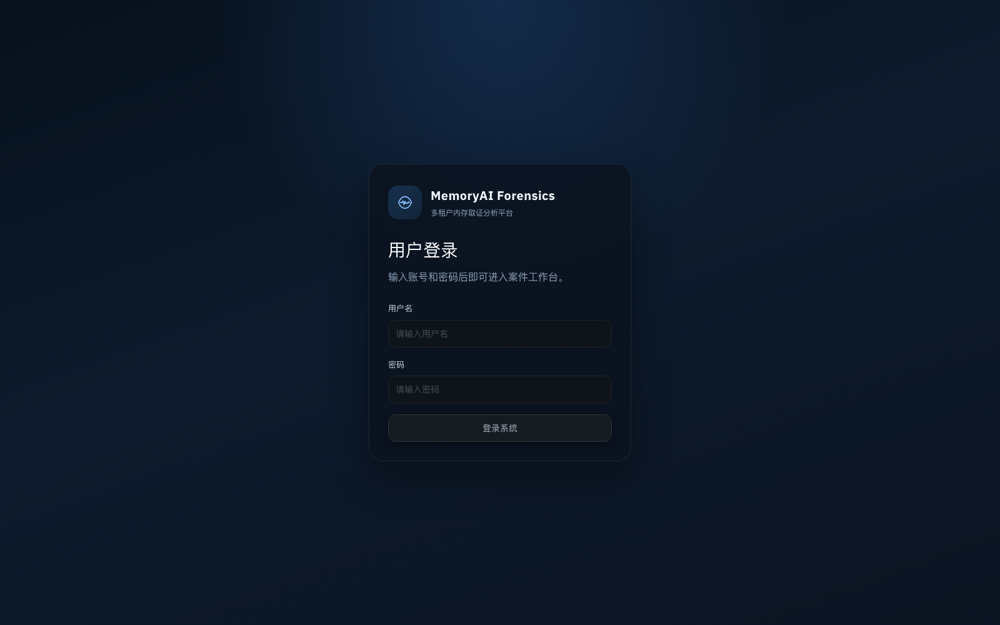
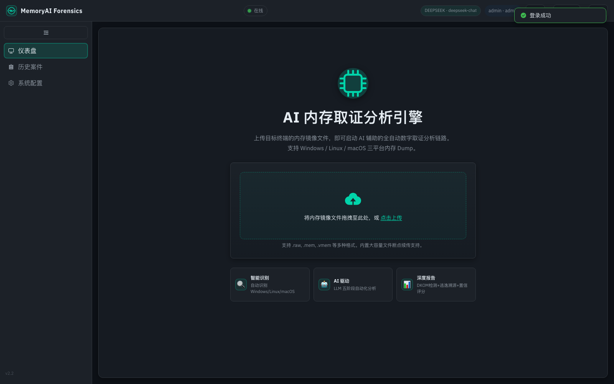
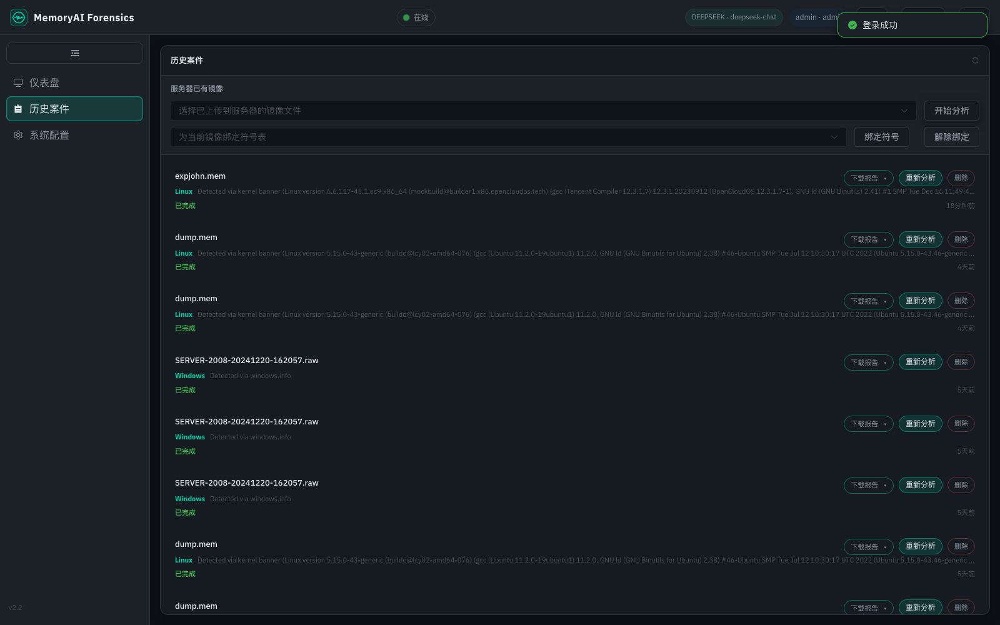
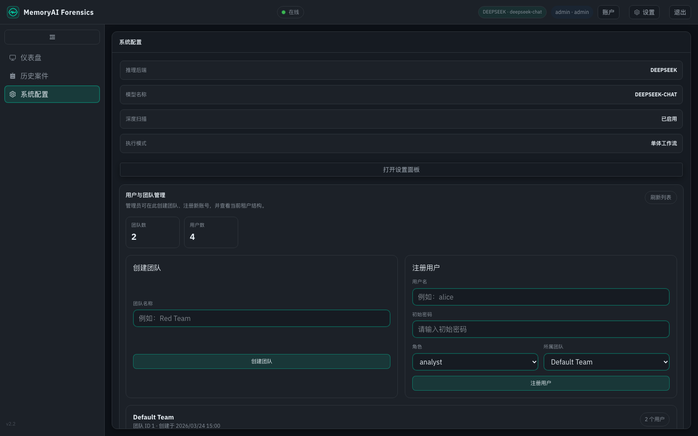
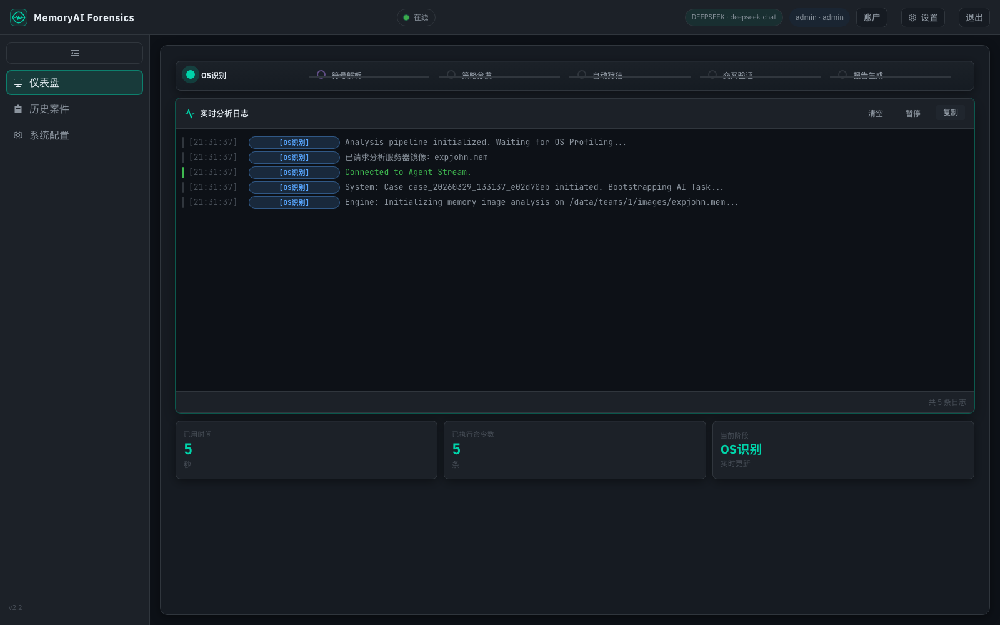
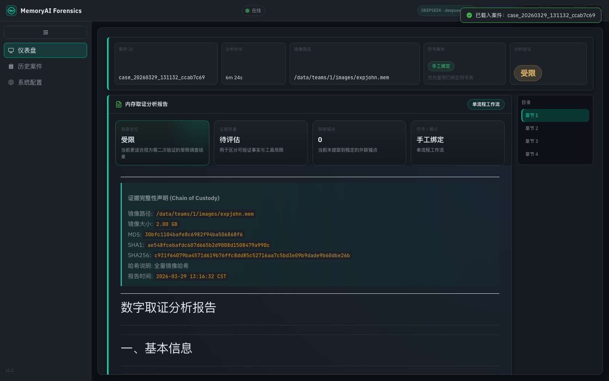
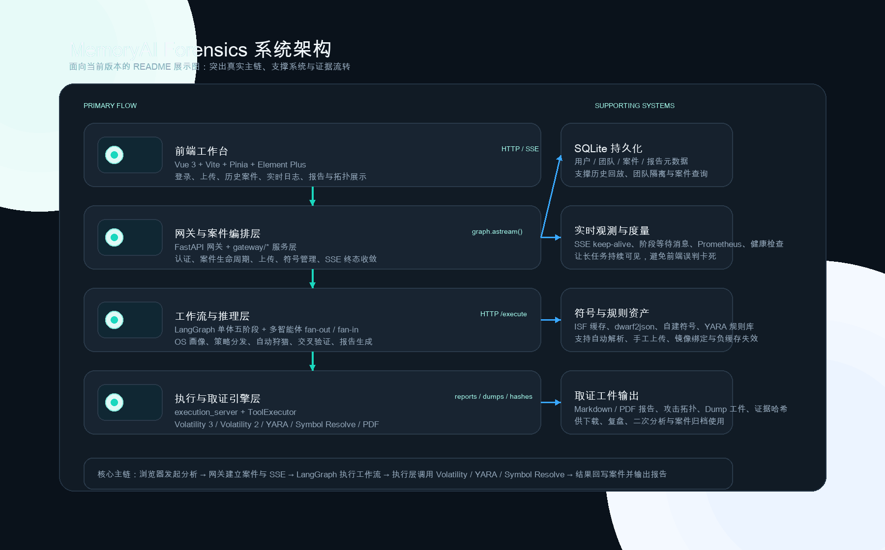

# MemoryAI Forensics

面向数字取证与安全运营场景的 AI 驱动内存取证平台。MemoryAI Forensics 将大语言模型、LangGraph 工作流编排、Volatility 取证能力、YARA 规则匹配与可视化案件工作台整合为统一分析链路，用于完成从内存镜像接入、自动化狩猎、证据交叉验证到结构化报告输出的端到端闭环。

> Built for memory-first investigation workflows, analyst-facing case management, and AI-orchestrated forensics at platform scale.

---

## Why MemoryAI Forensics

MemoryAI Forensics 不只是给 Volatility 套一层 Web 界面，而是围绕案件生命周期、流式分析体验、证据完整性、团队隔离与可复盘报告构建的取证分析平台。

当前版本具备以下核心能力：

- 多租户案件工作台，支持用户认证、团队隔离与历史案件回放
- 单体工作流与多智能体工作流两种分析模式
- Linux 符号自动解析、手工上传 ISF、上传 `vmlinux` 自动生成符号
- SSE 实时日志、阶段进度、长任务 keep-alive 与终态收敛
- SmartDumper 三级容错、YARA 交叉验证、DKOM / 孤儿进程逃逸检测
- Markdown / PDF 报告输出与攻击拓扑可视化

它适合被理解为一套“内存取证调查平台”，而不是单点取证脚本或单次分析 Demo：

- 对分析过程进行可视化与案件化组织
- 对长任务与异常路径进行平台级收敛
- 对 Linux 符号链、验证链和报告链进行统一编排
- 对团队协作、案件复盘与输出交付提供完整支撑

> 当前仓库为 Showcase 展示仓库，聚焦系统能力说明、界面展示与技术方案说明。完整工程实现与持续演进版本位于私有研发仓库中。

---

## Product Preview

### 登录页

### 仪表盘

### 历史案件

### 系统配置

### 分析过程

### 报告结果

以上截图均来自当前线上版本，覆盖了系统的主要使用路径：登录认证、镜像上传与分析启动、实时日志观察、历史案件回放、服务器已有镜像复用分析、报告查看，以及管理员侧系统配置与用户团队管理。

---

## Core Capabilities

### AI-Orchestrated Forensics Pipeline

- 五阶段主链路：`OS Profiling -> Strategy Dispatch -> Automated Hunting -> Cross Validation -> Reporting`
- 支持 LangGraph 单体工作流与多智能体 fan-out / fan-in 工作流
- LLM 负责策略分发、风险聚焦与报告研判，不直接替代底层证据采集

### Linux Symbol Intelligence

- Linux 路径支持本地缓存、公共仓库匹配下载、本地生成与 preflight 验证
- 支持手工上传 ISF 或 `vmlinux`
- 支持镜像与符号表绑定，后续分析可自动复用
- 手工补符号后主动失效执行层负缓存，无需等待服务重启

### Multi-Engine Evidence Collection

- Volatility 3 + Volatility 2 双执行引擎
- YARA 规则联动
- SmartDumper 三级容错：`procdump -> vaddump -> malfind`
- 网络锚点驱动的后续深挖：`cmdline / dlllist / handles`

### Investigation Workspace

- 多租户案件管理与历史案件复盘
- 服务器已有镜像复用分析
- SSE 实时分析日志与阶段可视化
- Markdown / PDF 报告输出
- 攻击拓扑与证据链展示

---

## Why It Stands Out

### Platform, Not Script

系统将“前端工作台、案件编排、工作流执行、底层取证引擎、证据输出”拆成清晰层次，适合持续迭代，而不是只能跑一条固定命令链。

### Investigation Experience Matters

从登录、上传、历史案件、服务器镜像复用、SSE 实时日志、报告查看到 PDF 导出，整套体验围绕分析员日常流程设计，而不是只关心后端能否执行成功。

### Failure Is a First-Class Concern

插件失败、Linux 符号缺失、长任务超时感知、浏览器断连、证据不足等情况都被纳入正式设计，而不是被视为异常边缘案例。

### AI With Boundaries

LLM 负责策略生成、可疑对象聚焦与报告组织，底层证据依旧来自 Volatility、YARA、Dump 工件与验证结果，这让平台既有自动化能力，也保留证据链的可解释性。

---

## Architecture

这张图展示了当前版本的主链：前端工作台通过 HTTP / SSE 进入 FastAPI 网关，由网关驱动 LangGraph 单体或多智能体工作流，再统一调用执行层完成 Volatility / YARA / Symbol Resolve / PDF 等取证动作；右侧则补充了 SQLite 持久化、实时观测、符号与规则资产、取证工件输出等关键支撑系统。

如需查看更贴近源码结构的详细工程拓扑，请参考 [Technical_Design.md](./Technical_Design.md)。

---

## Where It Fits

- 企业安全团队的内存镜像初筛、调查与复盘
- SOC / IR / 威胁狩猎场景下的受控自动化分析链路
- 安全产品团队构建 AI 驱动取证编排平台的工程参考
- Linux / Windows 内存取证自动化分析与证据归档
- AI Agent / LangGraph 在安全场景中的平台化落地展示

---

## Built For Review

这个 Showcase 仓库适合以下几类读者快速理解项目：

- 安全团队负责人：关注平台能力、流程闭环与输出结果
- 技术评审 / 面试官：关注系统边界、架构分层与工程完整性
- 合作方 / 潜在用户：关注界面形态、调查流程与交付能力
- 工程团队：关注 LangGraph、SSE、符号链与执行层解耦设计

---

## Technical Highlights

### Resilience by Design

- 插件失败优先降级，不因单点工具异常中断整条调查链
- `/agent/stream` 对 success / error / fallback / aborted / fatal exception 做终态收敛
- 前端禁用 side-effectful SSE 自动重连，避免重复建案

### Evidence-Centric Modeling

- 系统围绕 `validation_results`、`dump_results`、`evasion`、`topology_nodes/links` 等证据对象组织，而不是围绕页面拼装
- 报告与案件记录绑定镜像哈希、分析元数据与可复盘上下文

### Operational Visibility

- SSE keep-alive、阶段等待消息、Prometheus 指标与健康检查
- 长任务期间前端持续可见，避免“无输出即卡死”的误判

---

## Delivery Model

当前 Showcase 仓库主要用于：

- 展示产品能力与界面形态
- 说明系统设计与技术路线
- 向合作方、评审者、用人方展示平台化与工程化能力

如需进一步了解完整实现、技术交流或合作沟通，可基于本仓库内容继续联系。
