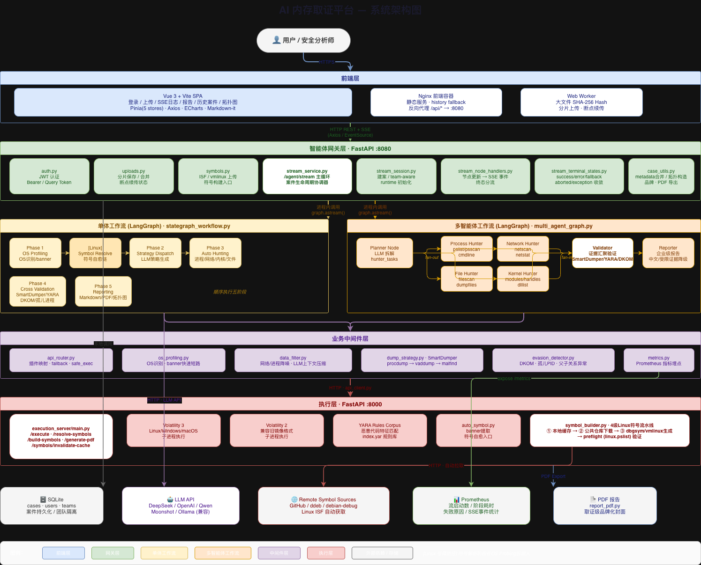

# Technical Design White Paper

## 1. Executive Summary

MemoryAI Forensics 是一套面向数字取证与安全运营场景的 AI 驱动内存取证平台。系统将大语言模型、LangGraph 工作流编排、Volatility 生态、YARA 规则匹配与可视化案件工作台整合为统一分析链路，用于完成从内存镜像接入、证据采集、交叉验证到结构化报告输出的端到端流程。

该平台的目标不是替代底层取证工具，而是把取证工具、工作流、证据链与分析工作台组织成一套可持续演进的工程化系统。

平台当前具备以下关键特征：

- 多租户案件工作台与历史案件回放
- 单体工作流与多智能体工作流双模式
- Linux 符号自动解析、手工补符号与镜像符号绑定
- Volatility 3 / Volatility 2 / YARA 联动执行
- SSE 实时日志、阶段进度、异常收敛与 Prometheus 指标
- Markdown / PDF 报告输出与攻击拓扑展示

---

## 2. Design Objectives

### 2.1 Primary Objectives

系统围绕以下四类目标设计：

1. 将复杂、非线性的内存取证流程组织为稳定可重复的调查链路
2. 在长任务和不稳定取证环境下，尽可能保证分析持续推进而不是中途崩溃
3. 让分析过程可视、可追踪、可复盘，而不是仅输出一个最终结论
4. 将 LLM 放在策略分发与分析研判位置，而不是让其替代证据采集

### 2.2 Non-Goals

该平台当前并不试图成为：

- 泛化 SOAR 平台
- 终端常驻 EDR 产品
- 面向所有取证介质的统一调查系统

它聚焦于“内存镜像驱动的调查闭环”。

---

## 3. Architectural Principles

### 3.1 Resilience First

内存取证环境天然存在长尾内核版本、损坏内存页、插件失败、符号缺失等问题。系统默认不以“单点成功”为前提，而以“尽量完成可用分析”为前提。

典型实现包括：

- 插件执行失败后的 fallback
- SmartDumper 三级容错
- Linux 符号自动解析与预检
- `/agent/stream` 的 success / fallback / aborted / exception 终态收敛

### 3.2 Evidence Before Narrative

系统将底层证据对象作为第一公民。LLM 负责对这些证据进行策略分发、聚焦和报告生成，但核心事实仍然来自 Volatility、YARA、dump 工件与验证结果。

### 3.3 Live Workflow Experience

分析过程必须持续可见。前端不应在长任务期间失去反馈，因此系统引入：

- SSE 流式日志
- keep-alive 心跳
- 阶段 waiting 消息
- 细粒度验证事件

### 3.4 Platform Boundaries

系统将“用户交互、案件编排、工作流执行、底层工具调用、持久化存储”解耦为明确层次，以便在后续演进中分别优化。

---

## 4. Layered Architecture

### 4.1 Overview

上图对应当前版本更贴近源码结构的工程拓扑。与 README 中的展示版架构不同，这里强调模块边界、调用关系与支撑系统。

### 4.2 Frontend Layer

前端采用 Vue 3 + Vite + Pinia 实现，承担以下职责：

- 登录与鉴权入口
- 内存镜像上传与断点续传
- SSE 实时分析日志展示
- 历史案件查看、删除、下载与重新分析
- 服务器已有镜像复用分析
- 系统配置、团队与用户管理
- 报告渲染与攻击拓扑展示

生产环境中，前端容器同时承担静态资源服务与 `/api/*` 反向代理职责。

### 4.3 Gateway Layer

网关基于 FastAPI，入口为 `api_server.py`，并进一步拆分为 `gateway/*` 服务层。

该层负责：

- 用户认证与权限校验
- 团队感知的案件管理
- 上传、符号管理、品牌导出等业务接口
- `/agent/stream` 的 SSE 编排
- 分析启动、终态收敛与历史案件持久化

这层是整个平台的业务编排中心，而不是单纯的 HTTP 路由集合。

### 4.4 Workflow Layer

工作流层基于 LangGraph，实现两类分析模式：

- 单体工作流：固定五阶段主链顺序执行
- 多智能体工作流：planner -> hunters -> validator -> reporter

工作流层不直接执行 Volatility 命令，而是通过统一 API 客户端调用执行层。

### 4.5 Execution Layer

执行层独立为 FastAPI 服务，负责：

- Volatility 3 / Volatility 2 / YARA 执行
- Linux 符号解析与自建
- PDF 报告生成
- 统一工具超时、子进程管理与执行输出收集

该层的职责是“执行证据采集动作”，而不是理解高层业务状态。

### 4.6 Persistence and Support Systems

支撑系统包括：

- SQLite：用户、团队、案件、报告元数据持久化
- Linux 符号缓存：ISF、自建符号与负缓存语义
- YARA 规则资产
- Prometheus 指标与健康检查
- PDF 输出链

---

## 5. Core Runtime Flow

从业务角度，系统的主线如下：

1. 用户登录并进入案件工作台
2. 上传内存镜像，或从服务器已有镜像中选择目标
3. 网关创建案件并启动 `/agent/stream`
4. 工作流完成 OS 画像
5. 若为 Linux，优先进行符号解析或绑定符号预检
6. 自动执行多维度证据采集
7. 对可疑对象进行 SmartDumper、YARA 与逃逸检测验证
8. 生成结构化报告与可视化输出
9. 网关完成案件收敛与持久化，供历史查看与再次分析

---

## 6. Workflow Model

### 6.1 Monolithic Workflow

单体工作流采用固定主链：

`OS Profiling -> Strategy Dispatch -> Automated Hunting -> Cross Validation -> Reporting`

其特点是：

- 结构简单，行为稳定
- 适合联调、批处理与稳定路径
- 更容易在复杂环境下维持一致性

### 6.2 Multi-Agent Workflow

多智能体工作流采用 fan-out / fan-in 结构：

`Planner -> Process / Network / Kernel / File Hunters -> Validator -> Reporter`

其特点是：

- 更适合并行拆任务与增强分析
- 适合展示 AI 编排能力
- 对状态收敛、事件桥接和容错要求更高

### 6.3 Why LangGraph

选择 LangGraph 的关键原因包括：

- 非线性流程表达能力强
- 节点状态可组合
- 流式事件容易桥接到 SSE
- 更适合将“阶段推进、工具执行、异常回退”组织成受控图结构

---

## 7. Symbol Strategy and Linux Support

Linux 取证的关键挑战在于符号表。

平台当前实现了分层符号策略：

1. 读取镜像与符号表显式绑定关系
2. 若存在绑定，优先做预检
3. 若无绑定或预检失败，按顺序尝试：
   - 本地缓存命中
   - 公共仓库匹配下载
   - `vmlinux` / `System.map` / `dwarf2json` 本地生成
4. 使用 `linux.pslist` 做 preflight 验证
5. 若仍失败，进入受限分析与降级报告

该设计的意义在于：

- 把原本完全人工的 Linux 符号处理，纳入平台可控流程
- 允许团队通过手工上传和镜像绑定显式提升命中率
- 在复杂内核场景下仍保留受限调查能力

---

## 8. Evidence Collection and Validation

### 8.1 Multi-Dimensional Hunting

自动化狩猎覆盖多个证据维度：

- 进程
- 网络
- 文件
- 内核
- OS 专项信息

系统通过中间件层对原始结果做清洗、降噪、压缩与语义统一，再交由后续验证与报告环节消费。

### 8.2 SmartDumper

为了提高样本提取成功率，系统采用三级容错策略：

- Level 0: `procdump`
- Level 1: `vaddump`
- Level 2: `malfind --dump`

这使系统在面对损坏进程、缺失头部或注入型载荷时，仍有较大概率得到可供后续分析的工件。

### 8.3 Evasion Detection

验证层重点覆盖以下逃逸场景：

- DKOM 差集检测
- 孤儿进程溯源
- 父子关系异常
- 网络锚点驱动的进程深挖

这些结果最终汇入：

- `validation_results`
- 风险结论
- 报告摘要
- 攻击拓扑

---

## 9. Case Model and Multi-Tenant Boundary

平台当前的多租户重点在于“案件隔离”，而不是底层存储完全隔离。

当前实现包括：

- 用户与团队模型
- 团队感知的案件查询与操作
- 团队内镜像符号绑定
- 历史案件与报告按团队上下文访问

需要明确的是：

- 镜像与部分底层资产仍基于共享目录组织
- 团队边界更多体现在业务访问层与案件元数据层

这是一种工程上务实的实现方式，适合当前阶段的平台目标。

---

## 10. Observability and Failure Convergence

系统不是把“成功路径”视为唯一目标，而是把“流程最终可收敛”视为平台能力的一部分。

当前实现包括：

- SSE keep-alive 与阶段 waiting 消息
- 分析启动、失败、完成的指标埋点
- Linux 符号解析进度桥接
- 异常 / fallback / aborted / fatal exception 的统一终态处理

这使得系统在面对长时间任务、浏览器断连、工具异常时，仍能维持可解释行为，而不是留下悬空的 `running` 案件。

---

## 11. Deployment Topology

平台支持两类典型部署方式：

- Docker Compose 开发环境
- Docker Compose 生产编排

生产环境中：

- 前端容器负责静态资源与反向代理
- `agent-client` 负责网关与工作流编排
- `execution-server` 负责底层取证执行

这种拆分保证了：

- 前端与执行层职责边界清晰
- 网关与执行层可独立演进
- 符号链、规则资产、PDF 输出等支撑能力可集中管理

---

## 12. Current Boundaries and Evolution

平台当前已经具备较强的工程完整性，但仍存在明确边界：

- Windows 多智能体链路仍更适合增强分析，不一定优于单体模式
- Linux 符号链无法保证所有内核版本都 100% 自动成功
- 攻击拓扑已具备基础实用性，但复杂链路仍可继续增强
- “分析结论”属于产品层归纳视图，最终判断仍应回到证据正文

未来更有价值的演进方向包括：

- 更细粒度的 hunter 并行与任务调度
- 更强的团队与资产边界管理
- 更成熟的报告模板与组织化输出
- 更丰富的验证器与攻击链建模能力

---

## 13. Closing Statement

MemoryAI Forensics 的核心价值，不在于简单地把 LLM、Volatility 和前端页面拼在一起，而在于把这些能力组织成一套可解释、可回放、可持续演进的内存取证平台。

它既强调自动化，也强调证据链；既追求体验，也坚持边界；既关注工作流编排，也尊重底层取证事实。这种平衡，是该平台在工程层面最重要的设计取向。
